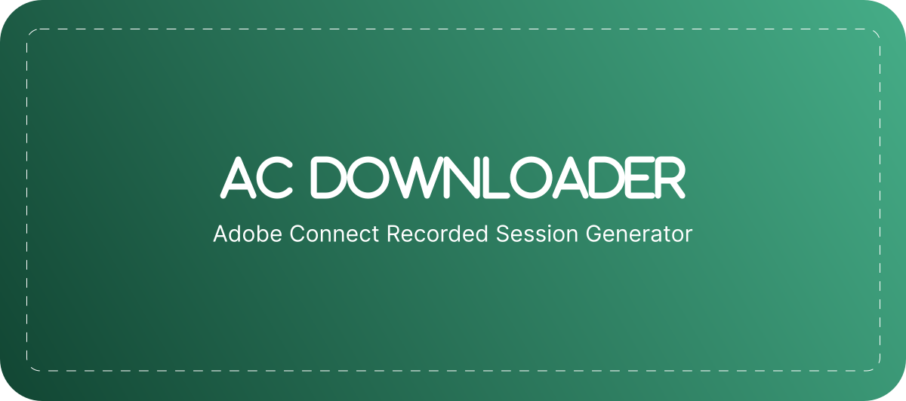

<p align="center">
  
</p>

<p align="center">
  <a href="LICENSE"></a>
  <a href="https://github.com/itsnyxdev/ac-downloader/releases"></a>
  <a href="https://github.com/itsnyxdev/ac-downloader/releases"></a>
  <a href="https://github.com/itsnyxdev/ac-downloader/actions/workflows/build.yml"></a>
  <a href="https://www.python.org/downloads/"></a>
  
  <a href="https://github.com/itsnyxdev/ac-downloader/releases"></a>
</p>

<p align="center">
  <strong>English</strong> | <a href="README.fa.md">فارسی</a>
</p>

<p align="center">
  <strong>Convert Adobe Connect recording sessions into clean MP4 files.</strong><br>
  A command-line tool that parses downloaded Adobe Connect recordings and merges their FLV streams into a single, high-quality MP4 video.
</p>

---

## Table of Contents

- [Overview](#overview)
- [Features](#features)
- [Requirements](#requirements)
- [Installation](#installation)
- [Quick Start](#quick-start)
- [Configuration](#configuration)
- [Usage](#usage)
- [Troubleshooting](#troubleshooting)
- [FAQ](#faq)
- [Roadmap](#roadmap)
- [What AC Downloader Is Not](#what-ac-downloader-is-not)
- [Releases](#releases)
- [Security](#security)
- [Support](#support)
- [Acknowledgements](#acknowledgements)
- [License](#license)

---

## Overview

Adobe Connect stores recorded sessions as fragmented FLV files paired with an `indexstream.xml` metadata file. Reassembling these fragments into a usable video is tedious and error-prone when done manually with FFmpeg.

**AC Downloader** automates this process. Point it at a downloaded recording directory, and it produces a single MP4 file with all streams properly synchronized, scaled, and encoded.

### How It Works

1. Parses `indexstream.xml` to discover all media streams (camera, VoIP, screen share) and their timestamps
2. Creates a base canvas (black video + silent audio) matching the full recording duration
3. Overlays each stream at its correct start time using FFmpeg
4. Encodes the result as H.264/AAC MP4

### Supported Platforms

| Platform | Architecture | Status |
|----------|-------------|--------|
| Windows  | amd64       | Supported (installer + portable) |
| Linux    | amd64       | Supported |
| macOS    | arm64       | Supported |

### Supported Input Formats

- Adobe Connect `indexstream.xml` metadata
- Adobe Connect `.flv` media fragments (cameraVoip, screenshare, and other stream types)

---

## ✨ Features

- Parse and process Adobe Connect `indexstream.xml` recording metadata
- Merge multiple FLV streams into a single MP4 file
- Automatic stream synchronization via timestamp-aware overlay
- Three quality presets: low (640x360), medium (1280x720), high (1920x1080)
- Multiple audio stream mixing with `amix` filter
- H.264 video + AAC audio encoding (yuv420p)
- Customizable output directory and quality settings
- TOML-based persistent configuration (`~/.acdl/config.toml`)
- Rich terminal output with color-coded status messages
- Cross-platform: Windows, Linux, macOS
- Standalone binaries (no Python installation required for end users)
- Windows installer with bundled FFmpeg

---

## 📋 Requirements

### Installer Users (Windows)

No additional dependencies. The Inno Setup installer bundles FFmpeg and FFprobe.

### Portable Binary Users

You need **FFmpeg** and **FFprobe** installed and available on your system `PATH`.

- **Windows**: Download from [BtbN/FFmpeg-Builds](https://github.com/BtbN/FFmpeg-Builds/releases) or [ffmpeg.org](https://ffmpeg.org/download.html). Extract and add the `bin/` directory to your `PATH`.
- **Linux**: Install via your package manager (e.g., `sudo apt install ffmpeg` or `sudo dnf install ffmpeg`).
- **macOS**: Install via Homebrew: `brew install ffmpeg`.

### Source Installation Users

- **Python 3.12** or later
- **uv** package manager ([installation guide](https://docs.astral.sh/uv/getting-started/installation/))
- **FFmpeg** and **FFprobe** (as described above)

---

## 🚀 Installation

### Windows

#### Inno Setup Installer (Recommended)

1. Download `ac-downloader-installer-amd64.exe` from the [latest release](https://github.com/itsnyxdev/ac-downloader/releases/latest)
2. Run the installer (requires administrator privileges)
3. FFmpeg is bundled — no additional setup needed
4. Open a new terminal and run `ac-downloader --version`

#### Portable Binary

1. Download `ac-downloader-windows-amd64.zip` from the [latest release](https://github.com/itsnyxdev/ac-downloader/releases/latest)
2. Extract the archive
3. Ensure FFmpeg is installed and on your `PATH` (see [Requirements](#portable-binary-users))
4. Run `ac-downloader.exe` from the extracted directory

### Linux

#### Binary

1. Download `ac-downloader-linux-amd64.tar.gz` from the [latest release](https://github.com/itsnyxdev/ac-downloader/releases/latest)
2. Extract: `tar -xzf ac-downloader-linux-amd64.tar.gz`
3. Move to a directory on your `PATH`: `sudo mv ac-downloader /usr/local/bin/`
4. Ensure FFmpeg is installed: `sudo apt install ffmpeg`
5. Verify: `ac-downloader --version`

#### From Source

```bash
git clone https://github.com/itsnyxdev/ac-downloader.git
cd ac-downloader
uv sync
uv run ac-downloader --version
```

### macOS

#### Binary

1. Download `ac-downloader-macos-arm64.tar.gz` from the [latest release](https://github.com/itsnyxdev/ac-downloader/releases/latest)
2. Extract: `tar -xzf ac-downloader-macos-arm64.tar.gz`
3. Move to a directory on your `PATH`: `sudo mv ac-downloader /usr/local/bin/`
4. Install FFmpeg: `brew install ffmpeg`
5. Verify: `ac-downloader --version`

> **Note**: If macOS blocks the binary with a Gatekeeper warning, run:
> ```bash
> xattr -cr /path/to/ac-downloader
> ```

---

## 🎯 Quick Start

The fastest way to convert your first recording:

```bash
# Convert a downloaded Adobe Connect recording
ac-downloader convert ./storage/my-recording

# Output is saved to ./output/output.mp4 by default
```

That's it. The tool parses the XML metadata, processes all FLV streams, and produces a single MP4.

---

## ⚙️ Configuration

### CLI Arguments

#### `convert`

```
ac-downloader convert <input_dir> [OPTIONS]
```

| Argument | Type | Default | Description |
|----------|------|---------|-------------|
| `input_dir` | Path (required) | — | Directory containing Adobe Connect recording files |
| `--output-dir`, `-o` | Path | `./output` | Directory for the generated MP4 file |
| `--quality`, `-q` | `low` \| `medium` \| `high` | `medium` | Video quality preset |

#### `config`

```
ac-downloader config show           # Display all configuration values
ac-downloader config set <key> <value>  # Set a configuration value
ac-downloader config reset          # Reset configuration to defaults
```

#### Global Options

| Option | Description |
|--------|-------------|
| `--version`, `-v` | Show version and exit |
| `--help`, `-h` | Show help message |

### Quality Presets

| Preset | Resolution | FPS | Use Case |
|--------|-----------|-----|----------|
| `low` | 640x360 | 24 | Small file size, fast processing |
| `medium` | 1280x720 | 30 | Balanced (recommended) |
| `high` | 1920x1080 | 30 | Maximum quality |

### Environment Variables

| Variable | Description |
|----------|-------------|
| `FFMPEG_PATH` | Path to the FFmpeg binary (overrides config file and PATH lookup) |

---

## 📚 Usage

### Basic Conversion

```bash
ac-downloader convert ./storage/my-recording
```

### Specify Output Directory

```bash
ac-downloader convert ./storage/my-recording --output-dir ./my-output
```

### High-Quality Output

```bash
ac-downloader convert ./storage/my-recording --quality high
```

### Batch Conversion (Shell)

Convert all recordings in a directory:

```bash
for dir in ./storage/*/; do
  ac-downloader convert "$dir" --output-dir ./output
done
```

## 🛠️ Troubleshooting

### FFmpeg Not Found

**Error**: `FFmpeg not found. Install it or set FFMPEG_PATH environment variable.`

**Solutions**:
1. Install FFmpeg (see [Requirements](#requirements))
2. Ensure `ffmpeg` is on your system `PATH`: `ffmpeg -version`
3. Set the `FFMPEG_PATH` environment variable to the binary location
4. Configure via `ac-downloader config set ffmpeg_path /path/to/ffmpeg`

### FFmpeg Installed but FFprobe Not Found

FFprobe is typically bundled with FFmpeg. If the converter can't find it:

1. Verify FFprobe exists: `ffprobe -version`
2. Ensure it's in the same directory as FFmpeg or on your `PATH`

### No indexstream.xml Found

**Error**: `No indexstream.xml found in <directory>`

The input directory must contain an `indexstream.xml` file. This file is part of the downloaded Adobe Connect recording session. Ensure you've downloaded the complete recording (not just the FLV files).

### No Media Streams Found

The `indexstream.xml` file may be empty or contain no valid stream events. Verify the recording was downloaded completely and the XML file is not corrupted.

### Permission Errors

- **Windows**: Run the terminal as administrator, or ensure the output directory is writable
- **Linux/macOS**: Check directory permissions: `ls -la <directory>`

### Conversion Fails Midway

Check the FFmpeg error output in the terminal. Common causes:
- Insufficient disk space
- Corrupted FLV files in the recording directory
- FFmpeg version incompatibility (FFmpeg 4.0+ recommended)

---

## ❓ FAQ

**Q: Do I need Python installed to use AC Downloader?**

No. The standalone binaries (portable or installer) are self-contained. Python is only needed if you install from source.

**Q: Can I convert recordings from Adobe Connect hosted instances?**

Yes, as long as you have downloaded the recording session locally (containing `indexstream.xml` and `.flv` files). AC Downloader processes local files — it does not connect to Adobe Connect servers.

**Q: What video codecs are used in the output?**

H.264 (libx264) for video and AAC for audio, in an MP4 container with yuv420p pixel format.

**Q: How long does conversion take?**

Processing time depends on the recording duration, number of streams, and quality preset. A typical 1-hour recording at medium quality takes a few minutes on modern hardware.

**Q: Can I change the output filename?**

Not yet. The output file is always named `output.mp4`. This is planned for a future release (see [Roadmap](#roadmap)).

**Q: Does AC Downloader upload my recordings anywhere?**

No. All processing is local. AC Downloader does not make any network requests.

---

## 🗺️ Roadmap

- [ ] TUI (Terminal User Interface) for interactive operation
- [ ] Embedded Adobe Connect downloader (direct URL input)
- [ ] Additional export formats (WebM, MKV, MOV)
- [ ] Custom output filename support
- [ ] Parallel stream processing for faster conversion
- [ ] Better metadata handling (preserve recording title, date, etc.)
- [ ] Progress bar with ETA during conversion
- [ ] Configuration validation and diagnostics command
- [ ] Docker image for headless/server environments

---

## ❌ What AC Downloader Is Not

To set clear expectations:

- **Not an Adobe Connect replacement** — It does not host, manage, or serve meetings
- **Not a downloader (yet)** — It converts already-downloaded recordings. The embedded downloader is on the [roadmap](#roadmap)
- **Not a video editor** — It does not trim, crop, add effects, or modify content
- **Not a livestream platform** — It processes recorded sessions only
- **Not a media server** — It produces files, not streams

---

## 📦 Releases

Download the latest release from the [GitHub Releases page](https://github.com/itsnyxdev/ac-downloader/releases).

| Artifact | Description |
|----------|-------------|
| `ac-downloader-installer-amd64.exe` | Windows installer (bundles FFmpeg, recommended) |
| `ac-downloader-windows-amd64.zip` | Windows portable binary |
| `ac-downloader-linux-amd64.tar.gz` | Linux binary |
| `ac-downloader-macos-arm64.tar.gz` | macOS ARM64 binary |

Release tags follow [Semantic Versioning](https://semver.org/). Pre-releases are tagged with a suffix (e.g., `v1.0.0-rc.4`).

---

## 🔒 Security

To report a security vulnerability, please open a [GitHub issue](https://github.com/itsnyxdev/ac-downloader/issues) with the `security` label, or contact the maintainers directly.

Do not disclose security issues publicly until a fix is available.

---

## 💬 Support

- **Bug Reports**: [GitHub Issues](https://github.com/itsnyxdev/ac-downloader/issues/new?template=bug_report.md)
- **Feature Requests**: [GitHub Issues](https://github.com/itsnyxdev/ac-downloader/issues/new?template=feature_request.md)
- **Questions**: [GitHub Discussions](https://github.com/itsnyxdev/ac-downloader/discussions)

---

## 🙏 Acknowledgements

AC Downloader is built on top of excellent open-source projects:

- [FFmpeg](https://ffmpeg.org/) — The multimedia framework that powers all video processing
- [Typer](https://typer.tiangolo.com/) — CLI framework
- [Rich](https://rich.readthedocs.io/) — Terminal formatting and output
- [PyInstaller](https://pyinstaller.org/) — Binary packaging
- [Pydantic](https://docs.pydantic.dev/) — Settings and validation
- [Loguru](https://loguru.readthedocs.io/) — Logging
- [rtoml](https://github.com/samuelcolvin/rtoml) — TOML file handling

---

## 📄 License

This project is licensed under the [MIT License](LICENSE).